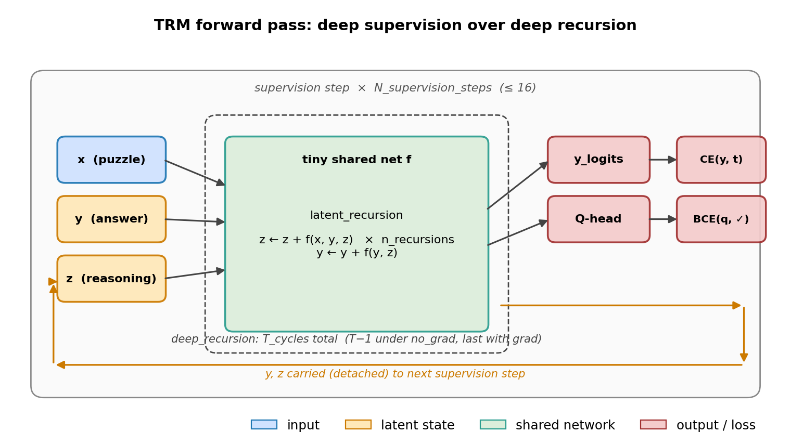
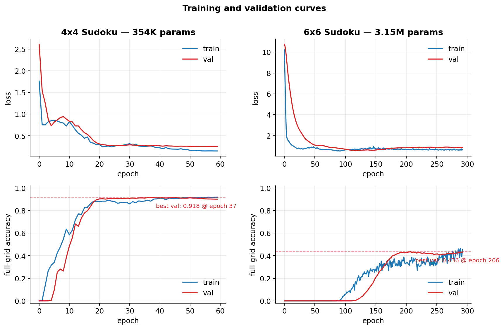
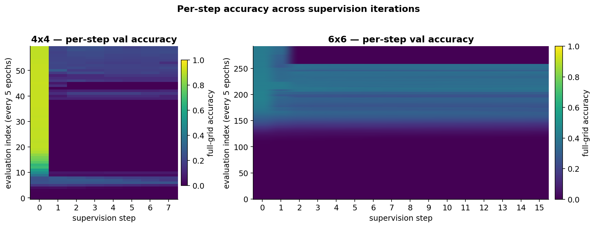
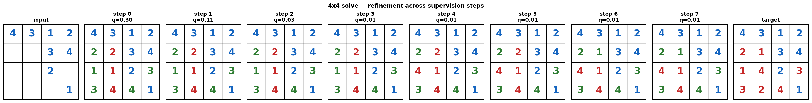
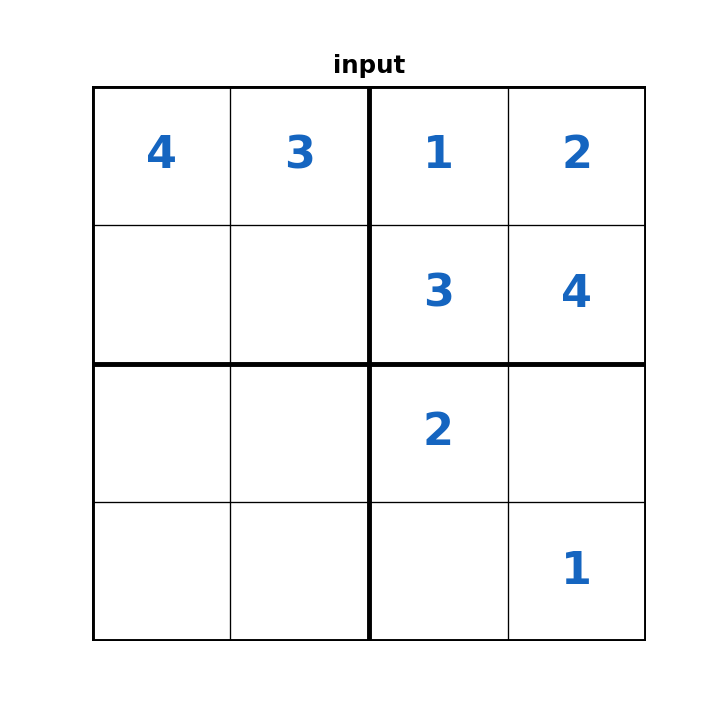
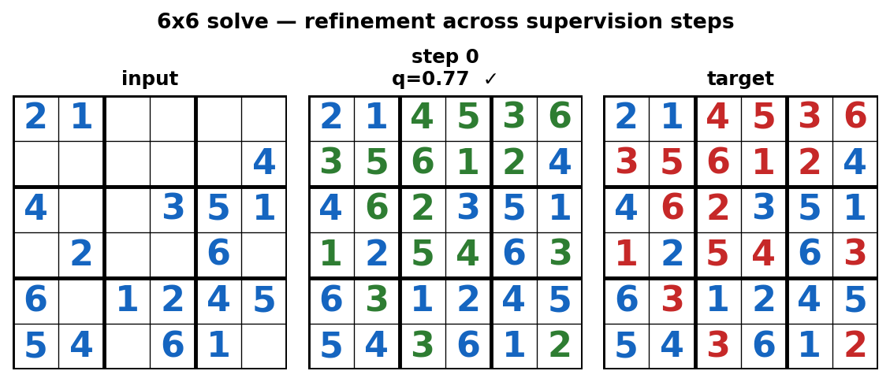
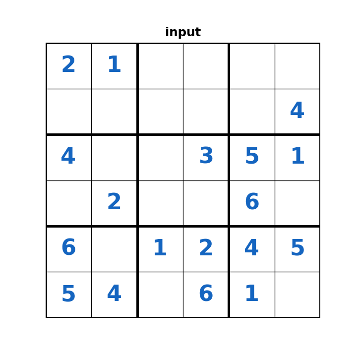

# Tiny Recursive Model — Sudoku

A from-scratch implementation of the **Tiny Recursive Model (TRM)** applied to
Sudoku of three difficulties (4×4, 6×6, 9×9). The goal is not to set
state-of-the-art on Sudoku — it's to study, in a setting small enough to fit on
a laptop GPU, the recipe at the heart of TRM-style models:

> *A small network whose forward pass is iterated many times, supervised at
> every iteration, with a learned halting head.*

Two ideas are doing the heavy lifting:

1. **Deep recursion in latent space.** A single tiny network `f` is applied
   many times inside one forward pass to update two latent states — `y` (the
   "answer") and `z` (the "reasoning scratchpad"). Most of those applications
   run under `torch.no_grad()`; only the last one carries gradients.
2. **Deep supervision with a halt head.** The recursion is wrapped in an outer
   loop of up to 16 *supervision steps*. Each step produces a prediction
   `y_logits` and a halt logit `q`. The cross-entropy on `y_logits` and the
   binary cross-entropy on `q` (target = "is the current answer correct?")
   are both backpropagated, and at inference the model can stop early once
   `sigmoid(q) > 0.5`.



The whole model — embeddings, the shared 2-layer network, output head, Q-head —
is **354K parameters for 4×4** and **3.15M for 6×6**.

---

## The recursion, in code

The forward pass is small enough to fit on one screen
([`trm.py`](trm.py)):

```python
def latent_recursion(self, x, y, z):
    for _ in range(self.n_recursions):       # update reasoning n times
        z_input = torch.cat([x, y, z], -1)
        z = z + self.network(z_input)
    y_input = torch.cat([y, z], -1)          # update answer once
    y = y + self.network(y_input)
    return y, z

def deep_recursion(self, x, y, z):
    with torch.no_grad():
        for _ in range(self.T_cycles - 1):   # T-1 cycles, no grad
            y, z = self.latent_recursion(x, y, z)
    y, z = self.latent_recursion(x, y, z)    # last cycle with grad
    y_logits = self.output_head(y)
    q        = self.q_head(y.mean(dim=1))
    return y.detach(), z.detach(), y_logits, q
```

The detach at the end is what makes the outer supervision loop tractable: each
supervision step gets its own short backprop graph (one `latent_recursion`
worth) instead of a graph that reaches all the way back to step 0.

For 6×6, even one full supervision step won't fit comfortably in memory along
with the optimizer state, so `train_step_by_step.py` takes one step further:
**forward one supervision step, backprop immediately, detach `y` and `z`**, and
only call `optimizer.step()` after all 16 steps have contributed gradients.

```python
for step_idx in range(n_supervision_steps):
    y, z, y_logits, q = model.forward_single_step(x_embedded, y, z)
    step_loss = (CE(y_logits, target) + BCE(q, is_correct)) / n_supervision_steps
    step_loss.backward()                     # frees the graph
    y, z = y.detach(), z.detach()            # carry state, drop history
optimizer.step()
```

This is the trick that makes a 16-step supervision schedule fit on consumer
hardware.

---

## Setup

```bash
pip install torch numpy matplotlib pillow

# Re-build the README figures from logs/ + checkpoints
python3 scripts/build_assets.py
```

---

## Reproducing each run

| size | trainable | trained on | command |
| ---- | --------- | ---------- | ------- |
| 4×4  | 354K      | ~10K examples (200 base × 50 augmentations)   | `python3 build.py`       |
| 6×6  | 3.15M     | 500K examples (1000 base × 500 augmentations) | `python3 train_6x6.py`   |
| 9×9  | 1.96M     | ~10K examples                                 | `python3 train_9x9.py`   |

`data_generation.py`, `sudoku_6x6_generator.py`, and `sudoku_9x9_generator.py`
provide a backtracking solver and a set of value-permutation / row-swap /
column-swap augmentations. The 6×6 dataset is generated lazily inside
`train_6x6.py`; for 9×9 the dataset is much smaller because generation is
slow.

Each run logs to `logs/<experiment_name>/` (see [`logger.py`](logger.py)):

- `config.json` — model + training hyperparameters
- `history.json` — per-epoch train/val loss + accuracy + learning-rate
- `step_accuracies.json` — per-supervision-step accuracy on the val set (every 5 epochs)
- `summary.json` — best/final metrics + total wall-clock
- `examples_*.npy`, `animation_*.gif` — periodic qualitative snapshots

---

## Results



| run                  | params | val acc (full grid) | epochs | notes |
| -------------------- | ------ | -------------------- | ------ | ----- |
| `trm_4x4_baseline`   | 354K   | **91.77%** (epoch 37) | 60   | Solid; train and val track together. |
| `trm_6x6_baseline`   | 3.15M  | **43.6%**             | ~290 | Plateaus well below 4×4 quality. |
| `trm_9x9_baseline`   | 1.96M  | —                     | —    | Logged config only; no completed history. |

The 4×4 result is what the recipe is supposed to do: a 354K-parameter network
generalizes to held-out 4×4 puzzles in tens of epochs. The 6×6 result is the
more interesting one — see *Where it breaks down* below.

### Per-step accuracy



This heatmap is read row-by-row. Each row is one validation evaluation (every
5 epochs); each column is the supervision-step index, and the color is the
fraction of val puzzles solved exactly at that step.

Two things stand out:

- **Most of the bright mass lives in column 0.** The trained model commits
  almost all of its predictions on the *first* supervision step. This is a
  direct consequence of the eval-time halting rule (`sigmoid(q).mean() > 0.5`):
  once the model is confident enough, the loop breaks and no later step is
  computed (the run logs zero for those steps).
- **Refinement is real but rare.** The faint banding in columns 1+ on 4×4 is
  the population of puzzles where the model *didn't* halt at step 0 and
  benefited from extra refinement. They are the minority — most of the work
  the recursion does ends up packed into a single supervision step.

### A 4×4 solve




Blue cells are givens. Green cells match the target; red cells don't. This
particular puzzle isn't one the model nails — the prediction stabilizes by
step 1–2 and then doesn't improve, so we see the "commit early" pattern from
the heatmap up close. The Q value drops from 0.30 to 0.01 across steps, which
is the halt head correctly reporting low confidence (without knowing the
target).

### A 6×6 solve




A puzzle the 6×6 model does solve — `q=0.77` at step 0, and the loop halts
immediately. On the puzzles the 6×6 model gets right, this is the typical
shape: one shot, high confidence, done.

---

## Where it breaks down

The 6×6 result is a useful negative finding. With **9× the data and ~9× the
parameters of the 4×4 run**, full-grid accuracy plateaus around 43% after
several hundred epochs. A few hypotheses, in rough order of suspicion:

- **The MLP-Mixer backbone hits its ceiling at 36 tokens.** Both saved
  checkpoints use `use_attention=False`. The token-mixing path in
  `MixerLayer` is a single MLP that takes the full sequence as input — its
  representational capacity for the longer-range constraints in 6×6 is plausibly
  the bottleneck. The Transformer variant in `trm.py` exists but wasn't trained
  to convergence here.
- **The supervision schedule collapses to step 0.** As the heatmap above
  shows, the halting head learns to fire immediately. Once that happens the
  outer loop stops contributing gradient signal — the model is effectively
  trained as a single-step predictor, which is the wrong inductive bias for
  6×6.
- **Latent-state truncation.** The detach between supervision steps means no
  gradient flows from later refinement steps back into earlier ones. The 4×4
  problem is small enough that this doesn't matter; for 6×6 it might.

These are the threads to pull on if the goal is to push 6×6 past 43%.

---

## Repo map

```
trm.py                   # model: TinyRecursiveModel + Transformer/MLP-Mixer backbones
build.py                 # SudokuDataset, EMA, vanilla train loop, train_epoch / evaluate
train_step_by_step.py    # per-step backward training (the trick that makes 6x6 fit)
train_with_logging.py    # wraps a training run with the JSON logger + per-epoch artifacts
logger.py                # TrainingLogger — writes config/history/step_accs/summary

data_generation.py       # 4x4 puzzle + solution generator
sudoku_6x6_generator.py  # 6x6 generator with augmentations
sudoku_9x9_generator.py  # 9x9 generator
train_6x6.py             # 6x6 entry point
train_9x9.py             # 9x9 entry point

evaluation.py            # per-step / per-position / error-class evaluation
visualization.py         # grid + step-by-step + animation rendering
demo.py                  # standalone HTML demo with examples baked in
scripts/build_assets.py  # rebuild the figures in this README

logs/                    # one subdir per experiment, JSON + figures + sample animations
assets/                  # figures referenced from this README
trm_4x4_sudoku.pt        # 4x4 checkpoint (best EMA weights, val acc 0.9177)
trm_6x6_sudoku.pt        # 6x6 checkpoint (best EMA weights, val acc 0.4364)
val_puzzles_6x6_10k.npy  # 10K held-out 6x6 puzzles
val_solutions_6x6_10k.npy
```

---

## Notes for future work

- Train the Transformer variant on 6×6 — `use_attention=True` is already
  implemented, just untrained at scale.
- Add a small entropy / step-spread penalty to the Q-head loss so the model
  can't trivially learn to halt at step 0. Without it, deep supervision
  degenerates into single-step supervision.
- 9×9 needs the larger dataset that `train_9x9.py` only builds at small scale
  by default; the ~5,400-sample setting is too small for an attention model
  with millions of parameters.
